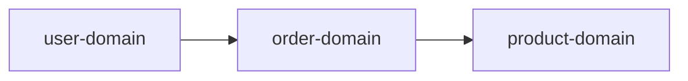

# asdm-req-domain-discovery: 发现并定义项目业务域

## 目的

自动分析代码库结构，识别项目实际的业务领域和技术架构，帮助用户快速建立领域划分。

**核心原则**：基于项目实际的代码结构识别领域，而非套用预设模板。

**兼容范围**：同时支持后端代码库（Java/Go/Node.js）和前端代码库（Vue/React）

## 语言检测

在分析之前，检测并使用当前环境的响应语言。

## 发现步骤

### 步骤 1: 识别项目类型

首先判断项目是后端还是前端：

```bash
# 检查是否有前端特征
ls -la src/ | grep -E "(views|pages|components)"
ls -la src/ | grep -E "(router|store|api|services)"

# 检查是否有后端特征
ls -la src/ | grep -E "(java|controller|service|domain|module)"
find src -name "*.java" -o -name "*Controller.java" | head -5

# 综合判断
if [ -d "src/views" ] || [ -d "src/pages" ]; then
    echo "Frontend project detected"
elif [ -d "src/main/java" ] || [ -f "pom.xml" ]; then
    echo "Backend project detected"
fi
```

### 步骤 2: 扫描代码结构

#### 后端项目扫描

```bash
# 扫描 Java 项目包结构
find src -type d -name "java" -exec find {} -type d \; 2>/dev/null | \
  sed 's|.*/src/main/java/||' | sed 's|.*/src/test/java/||' | \
  grep -v '^$' | sort | uniq

# 扫描 Maven 多模块项目
find . -name "pom.xml" -not -path "./pom.xml" | xargs dirname | sed 's|^\./||'

# 扫描 Spring Boot 特有的包
find src -type d -name "controller" -o -name "service" -o -name "repository" | head -20

# 扫描 Go 项目结构
find . -type d -name "internal" -o -type d -name "pkg" -o -type d -name "cmd" 2>/dev/null
```

#### 前端项目扫描

```bash
# 扫描 Vue/React 项目结构
find src -type d | sed 's|src/||' | grep -v '^$' | sort | uniq

# 扫描页面组件
find src -type f \( -name "*.vue" -o -name "*.tsx" -o -name "*.jsx" \) | \
  grep -E "(views|pages)" | sort

# 扫描路由配置
find src -type f \( -name "*.ts" -o -name "*.js" \) | \
  grep -E "(router|route)" | sort

# 扫描状态管理
find src -type f \( -name "*.ts" -o -name "*.js" \) | \
  grep -E "(store|stores|redux|pinia)" | sort

# 扫描 API 服务
find src -type f \( -name "*.ts" -o -name "*.js" \) | \
  grep -E "(api|service|request)" | sort

# 扫描组件目录
find src -type d -name "components" | xargs -I {} find {} -type d | head -20
```

### 步骤 3: 分析每个模块/包的职责

对于识别到的每个模块，分析其职责：

#### 后端项目分析

1. **分析 Controller/Handler 层**
   - 识别对外暴露的 API
   - 理解业务能力边界

2. **分析 Service 层**
   - 识别核心业务方法
   - 理解业务能力实现

3. **分析 Entity/Model 层**
   - 识别核心数据实体
   - 理解数据与能力的关系

#### 前端项目分析

1. **分析页面组件**
   - 读取页面组件的名称和路由定义
   - 查看组件内的注释和文档

2. **分析路由配置**
   - 读取路由配置文件
   - 理解每个路由对应的页面和功能

3. **分析 API 服务**
   - 读取 API 定义文件
   - 理解模块涉及的数据操作

4. **分析状态管理**
   - 读取 Store 定义
   - 理解模块涉及的状态管理

### 步骤 4: 基于实际结构归纳领域

**根据项目的实际目录结构**，归纳业务领域：

#### 后端项目归纳示例

```
扫描结果示例：
├── user-service/
│   ├── UserController.java
│   ├── UserService.java
│   └── UserRepository.java
├── order-service/
│   ├── OrderController.java
│   ├── OrderService.java
│   └── OrderRepository.java
└── product-service/
    ├── ProductController.java
    └── ProductService.java

AI 归纳结果：
┌─────────────────────────────────────────────────────────┐
│  识别到的领域（基于实际结构）                            │
├─────────────────────────────────────────────────────────┤
│                                                         │
│  1. 用户服务 (user-service)                             │
│     - 职责：用户注册、认证、Profile 管理                 │
│     - 依据：UserController, UserService                 │
│                                                         │
│  2. 订单服务 (order-service)                            │
│     - 职责：订单创建、查询、状态管理                     │
│     - 依据：OrderController, OrderService               │
│                                                         │
│  3. 商品服务 (product-service)                         │
│     - 职责：商品信息管理、库存管理                       │
│     - 依据：ProductController, ProductService           │
│                                                         │
└─────────────────────────────────────────────────────────┘
```

#### 前端项目归纳示例

```
扫描结果示例：
├── src/
│   ├── views/
│   │   ├── user/
│   │   │   ├── Login.vue
│   │   │   ├── Profile.vue
│   │   │   └── UserList.vue
│   │   ├── order/
│   │   │   ├── OrderCreate.vue
│   │   │   ├── OrderList.vue
│   │   │   └── OrderDetail.vue
│   │   └── dashboard/
│   │       └── Dashboard.vue
│   ├── router/
│   │   └── index.ts
│   ├── stores/
│   │   ├── user.ts
│   │   └── order.ts
│   └── api/
│       ├── user.ts
│       └── order.ts

AI 归纳结果：
┌─────────────────────────────────────────────────────────┐
│  识别到的模块（基于实际结构）                            │
├─────────────────────────────────────────────────────────┤
│                                                         │
│  1. 用户模块 (user-module)                              │
│     - 职责：用户登录、注册、个人资料管理                 │
│     - 依据：Login.vue, Profile.vue, UserList.vue       │
│     - 入口：src/views/user/                            │
│                                                         │
│  2. 订单模块 (order-module)                             │
│     - 职责：订单创建、查询、详情展示                     │
│     - 依据：OrderCreate.vue, OrderList.vue, OrderDetail │
│     - 入口：src/views/order/                            │
│                                                         │
│  3. 仪表盘模块 (dashboard-module)                        │
│     - 职责：数据统计、图表展示                           │
│     - 依据：Dashboard.vue                              │
│     - 入口：src/views/dashboard/                       │
│                                                         │
└─────────────────────────────────────────────────────────┘
```

### 步骤 5: 分析领域/模块间依赖

分析领域之间的依赖关系：

```markdown
## 领域依赖图


```

### 步骤 6: 生成领域发现报告

```markdown
# 项目领域发现报告

## 项目概述

**项目名称**：[实际项目名]
**项目类型**：[后端微服务 / 后端单体 / 前端 Vue / 前端 React / 前后端混合]
**代码结构**：[基于实际扫描结果描述]

## 识别的领域

基于项目实际结构，识别到以下领域：

| # | 领域名 | 职责描述 | 入口目录/文件 | 代码量 |
|---|--------|----------|--------------|--------|
| 1 | [领域A] | [根据代码分析得出的实际职责] | [核心文件] | X 行 |
| 2 | [领域B] | [根据代码分析得出的实际职责] | [核心文件] | X 行 |
| 3 | [领域C] | [根据代码分析得出的实际职责] | [核心文件] | X 行 |

## 领域详情

### 1. [领域A]

**职责**：[根据代码分析得出的职责]

**关键文件**：
- [文件1]
- [文件2]

**页面/API 列表**（如适用）：
| 页面/API | 文件 | 说明 |
|----------|------|------|
| [页面1] | [文件] | [说明] |

## 领域依赖关系

```mermaid
[基于实际依赖关系的图表]
```

## 建议

- [ ] 确认上述领域划分是否符合业务预期
- [ ] 是否有需要合并或拆分的领域
- [ ] 是否有遗漏的领域

## 下一步

确认领域后，使用 `/asdm-req-context-init` 初始化项目索引。
```

## 输出

| 输出 | 说明 |
|------|------|
| 领域发现报告 | 基于实际代码结构识别的领域 |
| 领域配置 | `.asdm/contexts/requirements/domains-config.json`（可选） |

## 使用方法

```bash
# 1. 发现领域
/asdm-req-domain-discovery

# 查看报告，确认领域列表

# 2. 初始化
/asdm-req-context-init

# 3. 为每个领域构建上下文
/asdm-req-domain-context-build <确认的领域名>
```

## 重要提醒

1. **不要预设领域**：不要假设项目一定有"用户域"、"订单域"
2. **基于实际结构**：根据项目实际的模块名、目录名来判断
3. **分析代码得出职责**：通过分析代码、路由、组件来理解每个领域做什么
4. **前端/后端差异**：
   - 后端：关注 Controller/Service/Repository 结构
   - 前端：关注 Views/Components/Router/Store 结构
5. **用户确认**：最终领域划分需要用户确认
