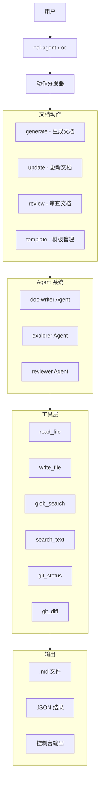

# AI Agent 文档编写 CLI 工具设计文档

## 1. 项目概述

### 1.1 背景

Cai Agent 已具备完整的 CLI 框架、LangGraph 状态机、工具系统和多角色 Agent 体系。当前缺少一个专门用于文档编写的 CLI 子命令，能够利用 AI Agent 能力自动化生成、更新和维护项目文档。

### 1.2 目标

设计并实现 `cai-agent doc` CLI 子命令，支持以下文档编写场景：

1. **文档生成**：根据代码库自动生成 README、API 文档、架构文档等
2. **文档更新**：基于代码变更自动更新相关文档
3. **文档审查**：检查文档与代码的一致性
4. **文档模板**：基于模板快速创建标准化文档

---

## 2. 架构设计

### 2.1 系统架构



### 2.2 模块划分

```
cai-agent/src/cai_agent/
├── doc_writer.py          # 文档编写核心模块
├── doc_templates.py       # 文档模板管理
└── doc_prompts.py         # 文档编写提示词
```

### 2.3 CLI 接口设计

```bash
# 文档生成
cai-agent doc generate --type readme --output README.md
cai-agent doc generate --type api --source src/ --output docs/API.md
cai-agent doc generate --type architecture --output docs/ARCHITECTURE.md

# 文档更新
cai-agent doc update --file README.md --based-on "recent changes"
cai-agent doc update --file docs/API.md --diff HEAD~3

# 文档审查
cai-agent doc review --file README.md
cai-agent doc review --all --output report.json

# 模板管理
cai-agent doc template list
cai-agent doc template create --name api-doc --output templates/
cai-agent doc template apply --name api-doc --output docs/API.md
```

---

## 3. 详细设计

### 3.1 文档类型定义

```python
@dataclass
class DocType:
    """文档类型定义"""
    name: str                    # 类型名称
    description: str             # 类型描述
    default_output: str          # 默认输出路径
    required_sections: list[str] # 必需章节
    optional_sections: list[str] # 可选章节
    prompt_template: str         # 提示词模板
```

支持的文档类型：

| 类型 | 名称 | 描述 | 默认输出 |
|------|------|------|----------|
| readme | README | 项目说明文档 | README.md |
| api | API 文档 | 接口文档 | docs/API.md |
| architecture | 架构文档 | 系统架构说明 | docs/ARCHITECTURE.md |
| changelog | 变更日志 | 版本变更记录 | CHANGELOG.md |
| contributing | 贡献指南 | 贡献者指南 | CONTRIBUTING.md |
| custom | 自定义 | 用户自定义 | - |

### 3.2 Agent 角色设计

#### doc-writer Agent

```python
# 角色定义
AgentConfig(
    role="doc-writer",
    max_iterations=15,
    tools=["read_file", "list_dir", "list_tree", "glob_search", 
           "search_text", "git_status", "git_diff", "write_file"]
)
```

**系统提示词**：
```
你是一个专业的技术文档编写专家。你的职责是：

1. 分析代码库结构和功能
2. 生成清晰、准确、易读的技术文档
3. 保持文档与代码的一致性
4. 遵循项目已有的文档风格和规范

在编写文档时，请遵循以下原则：
- 使用简洁明了的语言
- 提供实际的代码示例
- 保持结构清晰，使用适当的标题层级
- 包含必要的图表和流程说明
- 确保所有链接和引用有效
```

### 3.3 工作流模板

#### 文档生成工作流

```json
{
  "description": "三阶段文档生成：探索代码 → 分析结构 → 生成文档",
  "on_error": "fail_fast",
  "merge_strategy": "role_priority",
  "steps": [
    {
      "name": "explore",
      "role": "explorer",
      "goal": "探索代码库结构，分析项目的主要模块、功能和架构"
    },
    {
      "name": "analyze",
      "role": "default",
      "goal": "分析代码细节，提取关键信息，识别文档重点"
    },
    {
      "name": "write",
      "role": "doc-writer",
      "goal": "根据探索和分析结果，生成高质量的技术文档"
    }
  ]
}
```

#### 文档更新工作流

```json
{
  "description": "文档更新：分析变更 → 识别影响 → 更新文档",
  "on_error": "continue_on_error",
  "merge_strategy": "last_wins",
  "steps": [
    {
      "name": "diff-analysis",
      "role": "explorer",
      "goal": "分析代码变更，识别影响范围"
    },
    {
      "name": "impact-assessment",
      "role": "default",
      "goal": "评估变更对现有文档的影响"
    },
    {
      "name": "doc-update",
      "role": "doc-writer",
      "goal": "更新受影响的文档内容"
    }
  ]
}
```

### 3.4 文档模板系统

#### 模板结构

```yaml
# templates/api-doc.yaml
name: api-doc
description: API 接口文档模板
version: 1.0
sections:
  - name: overview
    title: 概述
    required: true
    content: |
      ## 概述
      
      {project_name} API 提供了...
  
  - name: authentication
    title: 认证
    required: true
    content: |
      ## 认证
      
      所有 API 请求需要...
  
  - name: endpoints
    title: 接口列表
    required: true
    content: |
      ## 接口列表
      
      ### {endpoint_name}
      
      **路径**: `{method} {path}`
      
      **描述**: {description}
      
      **请求参数**:
      
      | 参数 | 类型 | 必填 | 描述 |
      |------|------|------|------|
      | {param} | {type} | {required} | {desc} |
      
      **响应示例**:
      
      ```json
      {response_example}
      ```
  
  - name: error-codes
    title: 错误码
    required: false
    content: |
      ## 错误码
      
      | 错误码 | 描述 | 解决方案 |
      |--------|------|----------|
      | {code} | {desc} | {solution} |
```

### 3.5 核心数据结构

```python
@dataclass
class DocGenerateRequest:
    """文档生成请求"""
    doc_type: str                    # 文档类型
    output_path: str                 # 输出路径
    source_dirs: list[str]           # 源代码目录
    template: str | None = None      # 模板名称
    style_guide: str | None = None   # 风格指南
    language: str = "zh-CN"          # 文档语言
    include_examples: bool = True    # 是否包含示例
    max_depth: int = 3               # 分析深度


@dataclass
class DocGenerateResult:
    """文档生成结果"""
    success: bool
    output_path: str
    sections_generated: list[str]
    word_count: int
    elapsed_ms: int
    tokens_used: int
    warnings: list[str]
    error: str | None = None
```

---

## 4. 实现计划

### 4.1 Phase 1: 核心框架

1. 创建 `doc_writer.py` 核心模块
2. 实现 `doc` CLI 子命令注册
3. 实现基础的文档生成功能
4. 集成现有 Agent 系统

### 4.2 Phase 2: 高级功能

1. 实现文档更新功能
2. 实现文档审查功能
3. 添加模板系统
4. 支持多种文档类型

### 4.3 Phase 3: 优化完善

1. 添加文档风格指南支持
2. 实现增量更新
3. 添加文档质量评估
4. 性能优化

---

## 5. 与现有系统的集成

### 5.1 与 Workflow 系统集成

```python
# 添加文档生成工作流模板
_BUILTIN_TEMPLATES["doc-generate"] = {
    "description": "文档生成工作流",
    "steps": [...]
}
```

### 5.2 与 Skills 系统集成

创建 `skills/doc-writing.md` 技能文件，提供文档编写最佳实践。

### 5.3 与 Rules 系统集成

创建 `rules/common/documentation.md` 规则文件，定义文档编写规范。

---

## 6. 测试策略

### 6.1 单元测试

- 测试文档类型解析
- 测试模板渲染
- 测试 CLI 参数解析

### 6.2 集成测试

- 测试完整的文档生成流程
- 测试与 Agent 系统的集成
- 测试与 Workflow 系统的集成

### 6.3 端到端测试

- 测试真实代码库的文档生成
- 测试文档更新的准确性
- 测试文档审查的有效性

---

## 7. 示例用法

### 7.1 生成 README

```bash
# 自动生成 README
cai-agent doc generate --type readme

# 基于模板生成
cai-agent doc generate --type readme --template my-template

# 指定输出路径
cai-agent doc generate --type readme --output docs/README.zh-CN.md
```

### 7.2 更新 API 文档

```bash
# 基于最近变更更新
cai-agent doc update --file docs/API.md --based-on "recent"

# 基于 Git diff 更新
cai-agent doc update --file docs/API.md --diff HEAD~5

# 更新所有文档
cai-agent doc update --all
```

### 7.3 审查文档

```bash
# 审查单个文件
cai-agent doc review --file README.md

# 审查所有文档
cai-agent doc review --all --output review-report.json
```

---

## 8. 注意事项

1. **安全性**：文档生成不应修改源代码文件
2. **可逆性**：所有文档更新应可回滚
3. **性能**：大型代码库的分析应有超时控制
4. **一致性**：生成的文档应与项目风格保持一致
5. **国际化**：支持中英文文档生成
