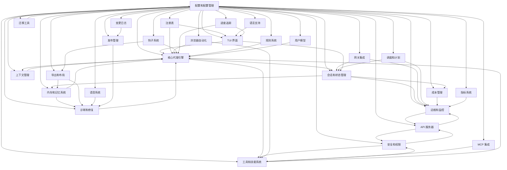

# 项目领域发现报告

## 项目概述

**项目名称**：CAI Agent  
**项目类型**：后端 Python 项目（AI 代理系统）  
**代码结构**：基于 LangGraph 的终端优先编码代理，集成自然语言处理、工作区管理和多平台网关

## 识别的领域

基于项目实际结构，识别到以下领域：

| # | 领域名 | 职责描述 | 入口目录/文件 | 代码量 |
|---|--------|----------|--------------|--------|
| 1 | 核心代理引擎 | 代理执行流程、LLM 调用、工具调度 | graph.py, tools.py, llm.py, llm_factory.py, workflow.py | ~150KB |
| 2 | 配置和配置管理 | TOML/环境变量配置、模型路由、配置文件解析 | config.py, profiles.py, model_routing.py, provider_registry.py | ~130KB |
| 3 | 会话和状态管理 | 会话持久化、事件追踪、任务状态 | session.py, session_events.py, task_state.py, board_state.py | ~30KB |
| 4 | 内存和记忆系统 | 记忆提取、存储、检索、健康检查 | memory.py, recall_audit.py, recall_fts5.py, insights_cross_domain.py | ~90KB |
| 5 | 工具和技能系统 | 工具执行、技能加载、插件注册 | tools.py, skills.py, skill_registry.py, skill_evolution.py, tool_provider.py | ~120KB |
| 6 | 网关集成 | 多平台网关（Discord, Slack, Teams, Email 等） | gateway_*.py (10+ 文件) | ~150KB |
| 7 | 运维和监控 | 运维仪表盘、操作监控、指标收集 | ops_dashboard.py, ops_http_server.py, observe_export.py, observe_ops_report.py, metrics.py | ~70KB |
| 8 | 安全和权限 | 权限控制、安全扫描、隐私过滤、沙箱 | permissions.py, security_scan.py, privacy_filter.py, server_auth.py, sandbox.py | ~25KB |
| 9 | 导出和布局 | ECC 导出、资产包管理、跨 harness 同步 | exporter.py, ecc_layout.py, ecc_ingest_gate.py | ~70KB |
| 10 | 诊断和修复 | 系统诊断、质量门禁、反馈收集 | doctor.py, quality_gate.py, feedback.py | ~70KB |
| 11 | 调度和计划 | 任务调度、发布运行手册 | schedule.py, release_runbook.py | ~30KB |
| 12 | TUI 界面 | 终端用户界面、斜杠命令、模型面板 | tui.py, tui_model_panel.py, tui_path_complete.py, tui_session_strip.py, tui_task_board.py | ~130KB |
| 13 | API 服务器 | HTTP API 服务器、信任管理 | api_http_server.py, http_trust.py | ~50KB |
| 14 | 注册表 | 代理、命令、插件注册表 | agent_registry.py, command_registry.py, plugin_registry.py | ~30KB |
| 15 | 浏览器自动化 | 浏览器提供者、MCP 集成 | browser_provider.py | ~13KB |
| 16 | 语音系统 | 语音提供者契约 | voice.py | ~2KB |
| 17 | 钩子系统 | 钩子运行时、钩子管理 | hook_runtime.py, hooks.py | ~17KB |
| 18 | 变更日志 | 语义变更日志、变更同步 | changelog_semantic.py, changelog_sync.py | ~3KB |
| 19 | 上下文管理 | 上下文压缩、会话回顾 | context.py, context_compaction.py | ~35KB |
| 20 | 成本管理 | 成本聚合、使用统计 | cost_aggregate.py | ~11KB |
| 21 | 语言支持 | 语言检测、本地化 | language.py | ~2KB |
| 22 | 迁移工具 | Claw 迁移 | claw_migrate.py | ~1KB |
| 23 | 进度追踪 | 进度环、全局状态 | progress_ring.py | ~3KB |
| 24 | 规则系统 | 规则加载、规则管理 | rules.py | ~2KB |
| 25 | 用户模型 | 用户模型存储、模型管理 | user_model.py, user_model_store.py | ~21KB |
| 26 | MCP 集成 | MCP 预设、MCP 服务 | mcp_presets.py, mcp_serve.py | ~9KB |
| 27 | 指标系统 | 指标收集、使用统计 | metrics.py | ~2KB |
| 28 | 发布管理 | 发布运行手册、版本管理 | release_runbook.py | ~5KB |

## 领域详情

### 1. 核心代理引擎

**职责**：代理执行流程、LLM 调用、工具调度、工作流执行

**关键文件**：
- `graph.py` - LangGraph 状态图构建和执行
- `tools.py` - 工具调度和执行
- `llm.py` - LLM 调用和响应处理
- `llm_factory.py` - LLM 工厂和配置
- `workflow.py` - 工作流模板和执行

**依赖关系**：
- 依赖：配置和配置管理、会话和状态管理、工具和技能系统
- 被依赖：TUI 界面、API 服务器、调度和计划

### 2. 配置和配置管理

**职责**：TOML/环境变量配置、模型路由、配置文件解析

**关键文件**：
- `config.py` - 主配置类和配置加载
- `profiles.py` - 模型配置文件管理
- `model_routing.py` - 模型路由规则
- `provider_registry.py` - 提供者注册表

**依赖关系**：
- 依赖：无（基础模块）
- 被依赖：几乎所有其他模块

### 3. 会话和状态管理

**职责**：会话持久化、事件追踪、任务状态

**关键文件**：
- `session.py` - 会话加载、保存、聚合
- `session_events.py` - 会话事件标准化
- `task_state.py` - 任务状态管理
- `board_state.py` - 看板状态管理

**依赖关系**：
- 依赖：配置和配置管理
- 被依赖：核心代理引擎、内存和记忆系统、运维和监控

### 4. 内存和记忆系统

**职责**：记忆提取、存储、检索、健康检查

**关键文件**：
- `memory.py` - 记忆条目管理
- `recall_audit.py` - 回忆审计
- `recall_fts5.py` - FTS5 索引
- `insights_cross_domain.py` - 跨域洞察

**依赖关系**：
- 依赖：会话和状态管理、配置和配置管理
- 被依赖：核心代理引擎、诊断和修复

### 5. 工具和技能系统

**职责**：工具执行、技能加载、插件注册

**关键文件**：
- `tools.py` - 工具调度和执行
- `skills.py` - 技能加载和管理
- `skill_registry.py` - 技能注册表
- `skill_evolution.py` - 技能进化
- `tool_provider.py` - 工具提供者

**依赖关系**：
- 依赖：配置和配置管理、安全和权限
- 被依赖：核心代理引擎

### 6. 网关集成

**职责**：多平台网关（Discord, Slack, Teams, Email 等）

**关键文件**：
- `gateway_discord.py` - Discord 网关
- `gateway_slack.py` - Slack 网关
- `gateway_teams.py` - Teams 网关
- `gateway_email.py` - 邮件网关
- `gateway_lifecycle.py` - 网关生命周期
- `gateway_production.py` - 生产网关

**依赖关系**：
- 依赖：配置和配置管理、会话和状态管理
- 被依赖：运维和监控

### 7. 运维和监控

**职责**：运维仪表盘、操作监控、指标收集

**关键文件**：
- `ops_dashboard.py` - 运维仪表盘
- `ops_http_server.py` - 运维 HTTP 服务器
- `observe_export.py` - 观察导出
- `observe_ops_report.py` - 观察运维报告
- `metrics.py` - 指标收集

**依赖关系**：
- 依赖：会话和状态管理、网关集成、调度和计划
- 被依赖：API 服务器

### 8. 安全和权限

**职责**：权限控制、安全扫描、隐私过滤、沙箱

**关键文件**：
- `permissions.py` - 权限控制
- `security_scan.py` - 安全扫描
- `privacy_filter.py` - 隐私过滤
- `server_auth.py` - 服务器认证
- `sandbox.py` - 沙箱环境

**依赖关系**：
- 依赖：配置和配置管理
- 被依赖：工具和技能系统、API 服务器

### 9. 导出和布局

**职责**：ECC 导出、资产包管理、跨 harness 同步

**关键文件**：
- `exporter.py` - 导出功能
- `ecc_layout.py` - ECC 布局
- `ecc_ingest_gate.py` - ECC 摄取门禁

**依赖关系**：
- 依赖：配置和配置管理、内存和记忆系统
- 被依赖：诊断和修复

### 10. 诊断和修复

**职责**：系统诊断、质量门禁、反馈收集

**关键文件**：
- `doctor.py` - 系统诊断
- `quality_gate.py` - 质量门禁
- `feedback.py` - 反馈收集

**依赖关系**：
- 依赖：配置和配置管理、导出和布局、内存和记忆系统
- 被依赖：核心代理引擎

### 11. 调度和计划

**职责**：任务调度、发布运行手册

**关键文件**：
- `schedule.py` - 任务调度
- `release_runbook.py` - 发布运行手册

**依赖关系**：
- 依赖：配置和配置管理、会话和状态管理
- 被依赖：运维和监控

### 12. TUI 界面

**职责**：终端用户界面、斜杠命令、模型面板

**关键文件**：
- `tui.py` - 主 TUI 应用
- `tui_model_panel.py` - 模型面板
- `tui_path_complete.py` - 路径补全
- `tui_session_strip.py` - 会话条带
- `tui_task_board.py` - 任务看板

**依赖关系**：
- 依赖：核心代理引擎、配置和配置管理、会话和状态管理
- 被依赖：无（终端用户界面）

### 13. API 服务器

**职责**：HTTP API 服务器、信任管理

**关键文件**：
- `api_http_server.py` - HTTP API 服务器
- `http_trust.py` - HTTP 信任管理

**依赖关系**：
- 依赖：配置和配置管理、安全和权限、运维和监控
- 被依赖：无（外部接口）

### 14. 注册表

**职责**：代理、命令、插件注册表

**关键文件**：
- `agent_registry.py` - 代理注册表
- `command_registry.py` - 命令注册表
- `plugin_registry.py` - 插件注册表

**依赖关系**：
- 依赖：配置和配置管理
- 被依赖：核心代理引擎、TUI 界面

### 15. 浏览器自动化

**职责**：浏览器提供者、MCP 集成

**关键文件**：
- `browser_provider.py` - 浏览器提供者

**依赖关系**：
- 依赖：配置和配置管理、工具和技能系统
- 被依赖：核心代理引擎

### 16. 语音系统

**职责**：语音提供者契约

**关键文件**：
- `voice.py` - 语音提供者

**依赖关系**：
- 依赖：配置和配置管理
- 被依赖：诊断和修复

### 17. 钩子系统

**职责**：钩子运行时、钩子管理

**关键文件**：
- `hook_runtime.py` - 钩子运行时
- `hooks.py` - 钩子管理

**依赖关系**：
- 依赖：配置和配置管理、导出和布局
- 被依赖：核心代理引擎

### 18. 变更日志

**职责**：语义变更日志、变更同步

**关键文件**：
- `changelog_semantic.py` - 语义变更日志
- `changelog_sync.py` - 变更同步

**依赖关系**：
- 依赖：配置和配置管理
- 被依赖：发布管理

### 19. 上下文管理

**职责**：上下文压缩、会话回顾

**关键文件**：
- `context.py` - 上下文构建
- `context_compaction.py` - 上下文压缩

**依赖关系**：
- 依赖：配置和配置管理、会话和状态管理
- 被依赖：核心代理引擎

### 20. 成本管理

**职责**：成本聚合、使用统计

**关键文件**：
- `cost_aggregate.py` - 成本聚合

**依赖关系**：
- 依赖：会话和状态管理、配置和配置管理
- 被依赖：运维和监控

### 21. 语言支持

**职责**：语言检测、本地化

**关键文件**：
- `language.py` - 语言检测

**依赖关系**：
- 依赖：配置和配置管理
- 被依赖：TUI 界面

### 22. 迁移工具

**职责**：Claw 迁移

**关键文件**：
- `claw_migrate.py` - Claw 迁移

**依赖关系**：
- 依赖：配置和配置管理
- 被依赖：无（独立工具）

### 23. 进度追踪

**职责**：进度环、全局状态

**关键文件**：
- `progress_ring.py` - 进度环

**依赖关系**：
- 依赖：无（基础模块）
- 被依赖：核心代理引擎、TUI 界面

### 24. 规则系统

**职责**：规则加载、规则管理

**关键文件**：
- `rules.py` - 规则管理

**依赖关系**：
- 依赖：配置和配置管理
- 被依赖：核心代理引擎

### 25. 用户模型

**职责**：用户模型存储、模型管理

**关键文件**：
- `user_model.py` - 用户模型
- `user_model_store.py` - 用户模型存储

**依赖关系**：
- 依赖：配置和配置管理
- 被依赖：核心代理引擎

### 26. MCP 集成

**职责**：MCP 预设、MCP 服务

**关键文件**：
- `mcp_presets.py` - MCP 预设
- `mcp_serve.py` - MCP 服务

**依赖关系**：
- 依赖：配置和配置管理
- 被依赖：工具和技能系统

### 27. 指标系统

**职责**：指标收集、使用统计

**关键文件**：
- `metrics.py` - 指标收集

**依赖关系**：
- 依赖：配置和配置管理
- 被依赖：运维和监控

### 28. 发布管理

**职责**：发布运行手册、版本管理

**关键文件**：
- `release_runbook.py` - 发布运行手册

**依赖关系**：
- 依赖：配置和配置管理、变更日志
- 被依赖：诊断和修复

## 领域依赖关系

## 建议

- [ ] 确认上述领域划分是否符合业务预期
- [ ] 是否有需要合并或拆分的领域
- [ ] 是否有遗漏的领域
- [ ] 确认领域间的依赖关系是否合理

## 下一步

确认领域后，使用 `/asdm-req-context-init` 初始化项目索引。
